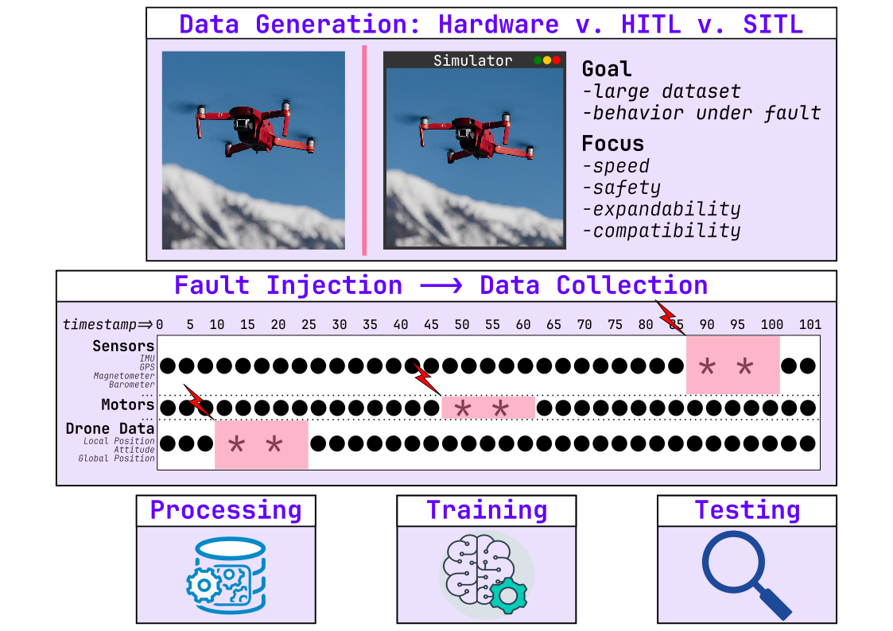

# Journal
collapsed:: true
	- Created an image to describe the fault injection task for Martin:
		- He wanted a way to display the content and extent of the Fault Injection Use Case that I did without having to read through large chunks of texts.
		- I decided on this
		- {:height 466, :width 648}
	-
- Next: [[Mar 19th, 2024]]