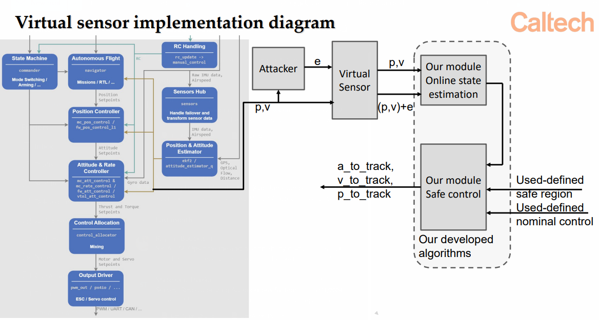

# Xiao Tan / Junior Sundar -- Technical Discussion
tag:: #MEETING
collapsed:: true
	- **Attendees**
		- Xiao Tan
		- Junior Sundar
		- Martin Andreoni
		- Willian Lunardi
	- **Goal**
		- Discuss the technical details of the experimentation (block diagram)
	- **Agenda**
		- Understand how the system is designed in terms of its block diagram
		- Brainstorm strategies to implement this in PX4
	- **Minutes**
		- Xiao wants the addition to be an external ROS Node that intercepts the EKF output and draws it out of the FC into a ROS Node.
		- I think there are two ways to go about this problem:
			- Directly bake in the modules into the flight controller firmware
			- Identify a method to bring out the data from the FC into a ROS Node and then work and feed it back in
		- Also drew a block diagram:
		- 
	- **Action Items**
		- ((6626c020-2327-420e-b629-822e1cb565d4))
		  :LOGBOOK:
		  CLOCK: [2024-04-04 Thu 23:04:14]
		  :END:
- Next: [[Apr 23rd, 2024]]