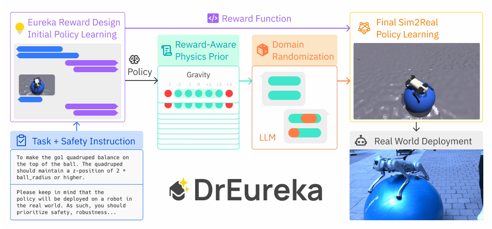

link:: https://eureka-research.github.io/dr-eureka/
file:: [ma2024.pdf](../assets/ma2024_1714973937398_0.pdf)
published:: [[May 3rd, 2024]]

- # Introduction
	- It is about transferring the policies learned in simulation to the real world.
	- Sim-to-real approaches rely on:
		- manual design.
		- tuning of the task reward function as well as simulation physics parameters.
	- Process is slow and human-labour intensive.
	- This is **LLM-guided** sim-to-real approach --> Requires only physics simulation for target task.
	- Automatically constructs suitable reward functions and domain randomisation distributions to support real-world transfer.
	- Demonstrated with quadruped locomotion and dexterous manipulation tasks.
	- Showcase approach in:
		- quadruped balancing
		- quadruped walking atop yoga ball
- # Process
	- To generate regularised reward function and policy, DrEureka:
		- takes task and safety instruction,
		- environment source code.
	- Tests policy under different simulation conditions to build reward-aware physics prior --> LLM generates set of [[Domain Randomisation]] parameters (DR).
	- Trains policies for real-world deployment using synthesised reward and DR parameters
	- 
- # Experiments
	- DrEureka evaluated against 3 tasks:
		- Quadruped globe walking,
		- Quadruped locomotion,
		- Dexterous cube rotation,
	- Uses GPT-4 as backbone LLM.
	- [Eureka](https://eureka-research.github.io/) hyperparameters are used for reward generation before sampling 16 DR configurations.
	- Baseline is human designed.
- # Results
	- ## Comparison to pre-existing sim-to-real configurations
		- DrEureka able to outperform Human-Designed in forward locomotion.
		- For rotation also it outperforms.
			- *NOTE*: Task permits very little room for error, thus policy either perform very well or extremely poorly.
		- Real-world robustness tested by placing quadruped in different testing environments:
			- Default - lab
			- Grass - lab
			- Sidewalk - world
			- Socks - lab
		- Method remains performant or outperforms human-designed.
		- DrEureka does not need a reward curriculum.
		- Safety instruction enables safe reward functions.
		- DrEureka reward qualitatively differs:
			- Multiplicative instead of additive.
			- More stringent penalties if safety terms are violated.
	- ## Efficacy of DR configurations
		- DrEureka surpasses DR optimisation baselines.
		- It uses physical reasoning to construct DR ranges.
- # Conclusion
	- All in all, DrEureka showed stable performance in sim-to-real transfer learning.
	- Shows ability of robots trained with this method to perform tasks that aren't originally part of training set and are generally complex (walking on globe)