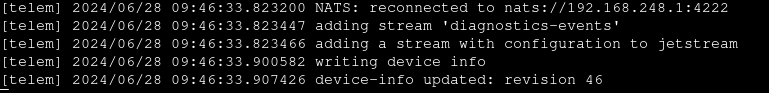

# Conversion `.gz` -> `.mp4`
	- ```bash
	  # Launch a NATS server
	  docker run --rm -it \
	  		--network host \
	          --env=NATS_TLS=unavailable \
	  		ghcr.io/tiiuae/drone-nats-server:main -D
	  ```
	- ```bash
	  # Obtain the video channel from the bagfile
	  nats-bag inspect <bag-file>.gz
	  # Then play the bag file to the server
	  nats-bag play <bag-file>.gz
	  ```
	- ```bash
	  nats sub <video_channel_name> | ffmpeg -f h264 -i pipe: -c copy output.mp4
	  # nats sub --raw <video_channel_name> | ffmpeg -i - -c copy output.mp4
	  ```
- # nats-bags from Drone [v12.0.3] (Example)
  id:: 667eab04-80e7-40e7-be51-2d2afc43fbbe
	- ## Introduction
		- Note that this is with the old GS/Fog role based system.
		- The PMC system has a different process; it can be done directly from the laptop itself.
	- ## Getting the NATS Address
		- Can be done from the FMO UI (in the Mission UI > Settings).
		- Alternatively, can attach into Drone's `nats` container to get the address.
		- EG:
		  
	- ## Dumping nats-bags
		- Attach to any system that is in the NATS network.
			- In this case, the Drone is an ideal specimen.
			- The GS is even more ideal since it has the server running in it.
			- *Need to test if it can be run from any system that is running the FMO UI*
		- Run command:
		  ```bash
		  docker run --rm -it \
		            --name nats-bag \
		            --network host \
		            --env=NATS_TLS=unavailable \
		            --entrypoint ./nats-bag \
		            --mount=type=bind,src=/home,dst=/home \
		            ghcr.io/tiiuae/tii-nats-bag:tls-support \
		            record \
		            --storage-dir /home \
		            --server ws://192.168.248.1:4280
		  ```
			- #+BEGIN_NOTE
			  `mount=type=bind,src=/home,dst=/home` and `--storage-dir /home` need to be configured as per use case
			  #+END_NOTE
		- This should dump the nats-bag (`.gz`) in the specified `/home` directory.
		- #+BEGIN_IMPORTANT
		  Make sure to delete the `.gz` files after use. If you leave it in, it may break shit up.
		  #+END_IMPORTANT
	- ## Additional Info
		- **`--server ws:/192.168.248.1:4280` instead of `--server nats://192.168.248.1:4222`**
		  collapsed:: true
			- Websocket instead of NATS TLS secure connection.
			- If you run latter, you will get the following error (most likely):
			  ```bash
			  tls: failed to verify certificate: x509: certificate signed by unknown authority
			  ```