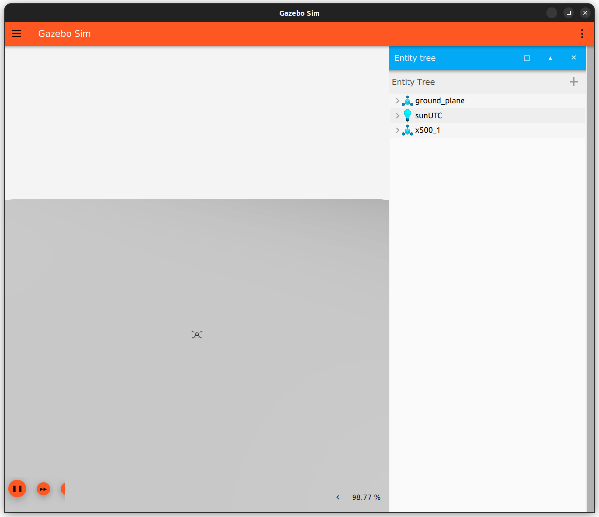

# Setting up a ROS 2 Workspace
	- ## Download
	  id:: 65f31e47-745e-419c-9baa-94010167b82e
		- ROS 2 comes installed with some basic packages. A ROS package is a directory or folder that contains code, data, and configuration files that provide a specific functionality or module. For instance, the “`sensor_msgs`” package contains common ROS 2 message types used to transfer sensor data such as PointCloud2, Image, DepthCloud, and so on.
		- For local installations, we need to set up a ROS Workspace. A ROS workspace is needed in this particular case because we need to install the `px4_msgs` and `px4_ros_coms` packages.
		- ```bash
		  # Create a workspace folder
		  mkdir -p ~/px4_ws/src
		  cd ~/px4_ws/src
		  # Clone the two packages into it
		  git clone https://github.com/PX4/px4_msgs.git
		  git clone https://github.com/PX4/px4_ros_com.git
		  ```
		- The `px4_msgs` is important for the ROS interface between controller and processor. All the uORB topics sent from the controller and repackaged into ROS 2 topics. In order for this to happen, there needs to be the appropriate message types in the companion processor which are inside the px4_msgs package.
		- Finally, we need to build the packages. ROS 2 uses the colcon build tool.
	- ## Build
		- ```bash
		  # Navigate to workspace root
		  cd ~/px4_ws
		  # Build packages
		  colcon build
		  ```
		- This should take some time at first run as the tool generates all the message files. Once finished, the workspace should have the following structure:
		- ```text
		   L px4_ws/
		       L build/
		           L ...
		       L install/
		           L ...
		       L log/
		           L ...
		       L src/
		           L px4_msgs
		           L px4_ros_coms
		           L <add more here>
		  ```
	- ## Source
	  id:: 65f8249b-4ccc-487e-bf6d-3e2afa2af6b0
		- Finally, since this is a local installation, we need to source this workspace so that we can access the locally installed packages. Refer to [this](((65f2ddcf-58ff-4e2e-856c-e4a1cb0fa507))) for more explanation.
		- In every new terminal that requires you to access packages from this local installation, run:
		- ```bash
		  source ~/px4_ws/install/local_setup.bash
		  ```
- # Listening to Data
	- ## Launch Simulation
		- The first step of this process requires us to launch the simulation through either Gazebo or JMavSim (i.e. simulator of choice). This is described in [[PX4 - Simulation]].
		- For this case, we will go with Gazebo. Upon building for SITL, the following window should open up:
		- 
	- ## Initialise μXRCE-DDS Agent
		- After than, ensure that the DDS agent is running so that the uORB topics are exposed to the ROS 2 framework. In a separate terminal run:
		- ```bash
		  MicroXRCEAgent udp4 -p 8888 
		  ```
	- ## Subscribing to ROS 2 Topics
		- As explained before, data from the PX4 is obtained from the ULog. The information is packaged into uORB topics inside the controller and transmitted to the companion processor through the μXRCE-DDS channel. At the agent side, the computer, this information is shared with ROS 2 as topics. The uORB topics are directly translated into ROS 2 topics once you activate the MicroXRCEAgent.
		- To see the topics available, open a new terminal and [source](((65f8249b-4ccc-487e-bf6d-3e2afa2af6b0))) the local installation of `px4_msgs`. After that, run:
		- ```bash
		  ros2 topic list
		  ```
		- In the terminal, you should now see something like this:
		- ```bash
		  # Publishable
		   /fmu/in/obstacle_distance
		   /fmu/in/offboard_control_mode
		   /fmu/in/onboard_computer_status
		   /fmu/in/sensor_optical_flow
		   /fmu/in/telemetry_status
		   /fmu/in/trajectory_setpoint
		   /fmu/in/vehicle_attitude_setpoint
		   /fmu/in/vehicle_command
		   /fmu/in/vehicle_mocap_odometry
		   /fmu/in/vehicle_rates_setpoint
		   /fmu/in/vehicle_trajectory_bezier
		   /fmu/in/vehicle_trajectory_waypoint
		   /fmu/in/vehicle_visual_odometry
		   
		   # Subscribable
		   /fmu/out/failsafe_flags
		   /fmu/out/position_setpoint_triplet
		   /fmu/out/sensor_combined
		   /fmu/out/timesync_status
		   /fmu/out/vehicle_attitude
		   /fmu/out/vehicle_control_mode
		   /fmu/out/vehicle_global_position
		   /fmu/out/vehicle_gps_position
		   /fmu/out/vehicle_local_position
		   /fmu/out/vehicle_odometry
		   /fmu/out/vehicle_status
		  ```
		- All subscribable topics can be observed in the terminal itself with the following command:
		- ```bash
		  ros2 topic echo /fmu/out/<topic_name>
		  ```
		- **NOTE** that if you don’t have the local installation sourced, the following error might pop up:
		- ```bash
		   The message type '<message_name>' is invalid
		  ```
		- In that case, simply source the local installation for the terminal and try again.
		- To get information about the message type being sent through these topics, run:
		- ```bash
		  ros2 topic info /fmu/out/<topic_name>
		  ```
		- The following subscribable topics are available out-of-the-box. A brief explanation of the data that is structured inside them is provided alongside.
		- | Topic Name                        | Description                                                                                    |
		   |-----------------------------------|------------------------------------------------------------------------------------------------|
		   | /.../out/failsafe_flags           | Flags for the failsafe state machine set by the arming & health checks.                        |
		   | /.../out/position_setpoint_triplet| Global position setpoint triplet in WGS84 coordinates.                                         |
		   | /.../out/sensor_combined          | Sensor readings in SI-unit form (gyro, accelerometer).                                         |
		   | /.../out/timesync_status          |                                                                                                |
		   | /.../out/vehicle_attitude         | This is similar to the mavlink message ATTITUDE_QUATERNION, but for onboard use.               |
		   | /.../out/vehicle_control_mode     | Flagging control modes.                                                                        |
		   | /.../out/vehicle_global_position  | Fused global position in WGS84. It is global position estimation not raw GPS.                  |
		   | /.../out/vehicle_gps_position     | GPS position in WGS84 coordinates.                                                             |
		   | /.../out/vehicle_local_position   | Fused local position in NED frame. Origin set to vehicle position at time of EKF module start. |
		   | /.../out/vehicle_odometry         | Vehicle odometry data. Fits ROS REP 147 for aerial vehicles.                                   |
		   | /.../out/vehicle_status           | Encodes system state of vehicle published by commander.                                        |
	- ## Exposing More Topics
		- [[PX4 - uORB]] shows the messages being actively exchanged inside the PX4 through uORB topics. Nearly all of them can also be accessed in ROS 2 as long as the Micro XRCE-DDS agent is active. You can find a list of message types available in ROS 2 [here](https://github.com/PX4/px4_msgs/tree/main/msg). You can cross-reference the uORB messages with the ROS 2 messages.
		- However, you can see that only a few out of this list are actually available when you call up the topic list. This is because it is possible to only passthrough selective topics through the Micro XRCE-DDS bridge. If you want to access more topics that aren’t in ROS 2 but available in the PX4 controller, add them to the [`dds_topics.yaml`](https://github.com/PX4/PX4-Autopilot/blob/main/src/modules/uxrce_dds_client/dds_topics.yaml) file in `~/PX4-Autopilot/blob/main/src/modules/uxrce_dds_client/`. You may need to build again after making this change.
		- Instructions on exposing additional topics through the DDS connection can be found [here](https://docs.px4.io/main/en/middleware/uxrce_dds.html#dds-topics-yaml).
- # Dockerised ROS 2 CLI
  id:: 65fd6a71-d167-47e0-819c-7e3645319411
	- In case you are working on a system that isn't Ubuntu derived, and you want to have access to ROS. A dockerised deployment may be preferred.
	  id:: 65fd6a71-6146-492b-9400-81e3966077c6
	- For this:
	- ```bash
	  git clone --recursive git@github.com:tiiuae/px4-sitl-docker.git px4-ros-docker
	  cd px4-ros-docker
	  
	  docker built -t px4-ros .
	  ```
	- Now commands can be run via the docker container itself.
	- ```bash
	  docker run -it --rm \
	      --network=host -p 14540:14540/udp \
	      --ipc=host --pid=host \
	      --env UID=$(id -u) \
	      --env GID=$(id -g) \
	      px4-ros ros2 <ros cli commands>
	  ```
	- Life can be made simpler by creating aliases for this.
	- ```bash
	  alias px4_ros="docker run -it --rm \
	      --network=host -p 14540:14540/udp \
	      --ipc=host --pid=host \
	      --env UID=$(id -u) \
	      --env GID=$(id -g) \
	      px4-ros ros2"
	  ```
	- To record rosbags, we need to first mount a dumping ground in the local machine into the docker container.
	- id:: 66028b69-abda-4385-a75d-6cee3223fd32
	  ```bash
	  docker run -it --rm \
	      --network=host -p 14540:14540/udp \
	      --ipc=host --pid=host \
	      --env UID=$(id -u) \
	      --env GID=$(id -g) \
	      -v $HOME/rosbags:/ros_workspace/bags \
	      px4-ros ros2 bag record -s mcap --all
	  ```
- # [Example of UAV Control](((662a3a36-8194-4a09-913a-b5a27851878d)))