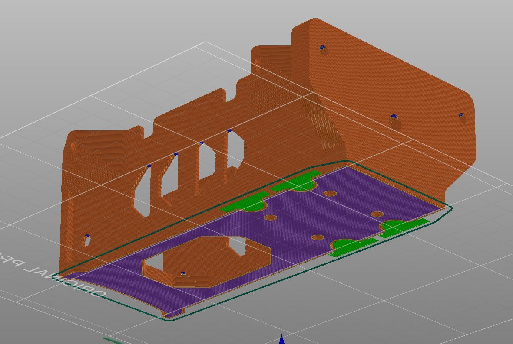

# Tasks
	- DONE Which camera is being used for image segmentation
	  collapsed:: true
	  :LOGBOOK:
	  CLOCK: [2024-04-25 Thu 13:29:44]--[2024-04-25 Thu 13:29:45] =>  00:00:01
	  CLOCK: [2024-04-25 Thu 13:29:45]--[2024-05-01 Wed 15:15:09] =>  145:45:24
	  :END:
		- [Luxonis OAK-D S2](https://shop.luxonis.com/products/oak-d-s2?variant=42455432233183) - This has been tested with Release12 and proven to work as front-facing.
		- [SIYI A8 Mini](https://shop.siyi.biz/products/siyi-a8-mini) - This is the model being used in Masdar and in F4F Prague for downward facing gimbal.
	- DONE How is the data being recorded?
	  :LOGBOOK:
	  CLOCK: [2024-04-25 Thu 13:29:54]--[2024-04-25 Thu 14:04:41] =>  00:34:47
	  :END:
		- DONE It is known that the data is being dumped in ROSbags somewhere, how to extract this?
		  collapsed:: true
			- It can be recorded using [`nats-bag`](https://github.com/tiiuae/nats-bag)
			- A laptop or GCS that is in the same NATS network can record the data streamed through NATS.
			- ```bash
			  nats-bag [-s nats://localhost:4222] record [filename]
			  ```
		- DONE Is recording happening continuously or is it to be triggered?
		  collapsed:: true
			- The gimbal stream needs to be activated by opening the stream through `dronsole` UI or running:
			- ```bash
			  nats pub video.cmd.<device-id> '{"subscriber": "id1", "subscribe":true}'
			  ```
	- DONE Confirm if Siyi A8 is supported for Release12
	  collapsed:: true
	  :LOGBOOK:
	  CLOCK: [2024-04-26 Fri 13:37:25]
	  :END:
		- It is supported as as confirmed by the people at F4F
	- DONE Create Slack channel with all concerned parties
	  :LOGBOOK:
	  CLOCK: [2024-04-26 Fri 11:11:52]--[2024-04-26 Fri 11:11:52] =>  00:00:00
	  :END:
	- DONE Fill up the hardware requirements spreadsheet
	  SCHEDULED: <2024-04-26 Fri 12:00>
	  :LOGBOOK:
	  CLOCK: [2024-04-26 Fri 11:11:58]--[2024-04-26 Fri 14:05:10] =>  02:53:12
	  :END:
	- DONE Verify the need for grass patches for the image segmentation demonstration
	- DONE Data collection from testing team follow-up --> Awaiting Tintu's go-ahead
	  collapsed:: true
		- They don't have enough Saluki V3 to go around, so we will have to affix ours on a drone. Furthermore, we will have to use the x500 Holybro.
		- There isn't a set method to attach the Siyi A8 camera to the drone, so we will have to think up some strategy, maybe by trying double tape or something.
	- DONE Get on Solita about getting camera segmentation demo ready
	  id:: b314a9ab-785e-42c9-a642-90a146d98179
	  :LOGBOOK:
	  CLOCK: [2024-05-02 Thu 12:00:17]--[2024-05-02 Thu 12:50:55] =>  00:50:38
	  :END:
		- DONE How is the video to be retrieved? Is there some code in place for this?
		  collapsed:: true
		  :LOGBOOK:
		  CLOCK: [2024-05-02 Thu 12:00:16]--[2024-05-02 Thu 12:50:51] =>  00:50:35
		  CLOCK: [2024-05-02 Thu 12:50:51]--[2024-05-02 Thu 12:50:52] =>  00:00:01
		  :END:
			- Video is going to be retrieved from the NATS channel subscriber.
			- There will be implementation in place to do this.
		- DONE Determine how the plugin for camera segmentation is to be implemented
		  collapsed:: true
		  :LOGBOOK:
		  CLOCK: [2024-05-02 Thu 12:00:17]--[2024-05-02 Thu 12:50:52] =>  00:50:35
		  :END:
			- This will not be implemented as a plugin, since the image-segmentation does not change the state of SRTA based on outputs.
			- The safe-landing container is providing coordinates to the SRTA in order to perform the action if the SRTA plugins so decide or its ordered from the FMO.
	- CANCELLED Verify if this method can be used to record data in the outdoor arena demo -- talk to Jose Segovia --> Planned shift to T-motor M690b
	  id:: 66386c1b-cb4c-4ea2-a161-fd8ffedf4d86
	  :LOGBOOK:
	  CLOCK: [2024-04-25 Thu 14:04:21]--[2024-04-25 Thu 14:04:42] =>  00:00:21
	  CLOCK: [2024-05-14 Tue 13:27:01]
	  :END:
	- DONE Triggering the RTA modules
	  id:: f5c16267-b6ca-4126-be07-13ac7b5dcaed
	  :LOGBOOK:
	  CLOCK: [2024-05-02 Thu 13:51:05]--[2024-05-06 Mon 11:39:34] =>  93:48:29
	  :END:
		- DONE Check first what kind of triggers can be implemented with Solita.
		  collapsed:: true
			- There is a placeholder in place inside SRTA and it is awaiting the UI implementation on the UI/FMO side of the things.
		- CANCELLED Check with Mehmet if something like this needs to be implemented in the software and control scheme for the drone
	- DONE Printing the mounts and attach it to the drone
	  :LOGBOOK:
	  CLOCK: [2024-05-02 Thu 12:40:27]--[2024-05-09 Thu 20:13:04] =>  175:32:37
	  :END:
		- DONE Saluki V3 to Drone Mount
		  :LOGBOOK:
		  CLOCK: [2024-05-02 Thu 15:45:33]--[2024-05-07 Tue 09:30:52] =>  113:45:19
		  :END:
		- DONE Siyi A8 and Battery Mount
		  collapsed:: true
		  :LOGBOOK:
		  CLOCK: [2024-05-02 Thu 15:45:36]--[2024-05-09 Thu 20:13:03] =>  172:27:27
		  :END:
			- 
	- CANCELLED Check if video encoding/decoding is happening on the hardware (Siyi A8)
	  id:: c67ddd53-eec8-405d-bd77-4ec7a07c120d
	- DOING Mount Saluki V3 to the ~~Holybro-X500~~ T-Motor M690b Drone and get it airborne
	  id:: 66386c1b-1e6c-4481-b1f3-08b18d2a9fc6
	  :LOGBOOK:
	  CLOCK: [2024-05-09 Thu 20:13:13]
	  :END:
		- DONE Obtain Saluki V3
		- DONE Set up Saluki V3 for flight mission
		  :LOGBOOK:
		  CLOCK: [2024-05-10 Fri 17:58:18]--[2024-05-13 Mon 21:27:34] =>  75:29:16
		  :END:
		- DOING Mount Saluki V3 to ~~Holybro~~ T-Motor M690b Drone
		  :LOGBOOK:
		  CLOCK: [2024-05-13 Mon 21:27:30]
		  :END:
	- TODO Obtain some long duration continuous flight missions from F4F
	  id:: 6644986f-3693-4f9a-a761-d89d522561e0
	- DOING Freeze code and model
	  id:: 6644991b-cbe7-4882-9761-382fc01aeb4c
	  SCHEDULED: <2024-06-30 Sun>
	  :LOGBOOK:
	  CLOCK: [2024-05-15 Wed 15:17:19]
	  :END:
	- TODO Demo
	  id:: 664499d6-f73c-49a9-bd7c-6d2ddd36eb87
	  SCHEDULED: <2024-07-01 Mon>
- # Notes
	- Task changes because it was possible to receive a T-Motor M690b assigned for SRTA Team
		- ((66386c1b-cb4c-4ea2-a161-fd8ffedf4d86))
		- ((66386c1b-1e6c-4481-b1f3-08b18d2a9fc6))
	- Why go for the T-Motor drone over the Holybro?
		- Final deployment is with T-Motor drone swarms.
		- If it is possible for F4F to repeat and replicate non-normal flight test cases, then it can be replicated in Masdar for testing. This will save chances of drone being wrecked here.
		- If F4F does not have Holybro procured, then lead time to data collection is uncertain.