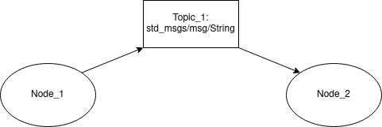
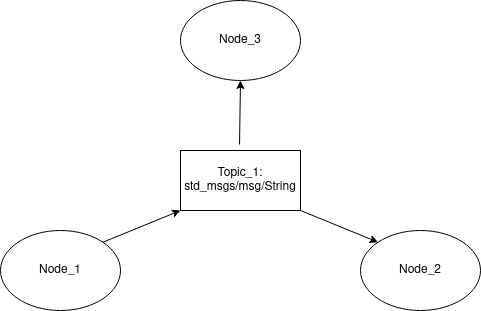
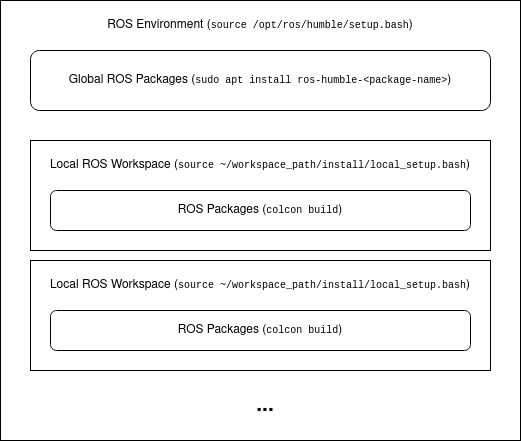

# Introduction
	- Set of software libraries and tools that help build robot applications. It is an open-source, meta-operating system for the robot. It provides the services expected from an OS, including:
		- hardware abstraction,
		- low-level device control,
		- implementation of commonly-used functionality,
		- message-passing between processes, and
		- package management.
	- As of now, it primarily runs only on Unix platforms, though as of ROS 2 it is also available in windows.
	- ## ROS 1 vs ROS 2
		- > *Access reference for [[ROS 1]] and [[ROS 2]]*
		- ### Differences
			- | Point      | ROS 1 | ROS 2   |
			  |------------------|--------------|------------|
			  | *Introduction and Legacy* | First version, introduced in 2007. Used in academia and hobbyist projects. | Launched in 2017 as an overhaul of ROS 1.  |
			  | *Communication Infrastructure* | Master-salve architecture with ROS Master.    | Distributed graph architecture without central master. |
			  | *Networking and Security* | Limited networking features. Not security-focused. | Enhanced networking with DDS support. Built-in security features.  |
			  | *Real-Time Support* | Limited support for real-time processes. | Improved real-time computing support. |
			  | *Client Libraries and Languages* | Primarily supports C++ and Python | Supports more languages; modular architecture. |
			  | *Community and Ecosystem* | Large community with many packages and tools. Focus shifting to ROS 2. | Growing community; ongoing development for robustness and enterprise features. |
		- ### Key Considerations
			- *Legacy vs. Modern Requirements* - ROS 1 is suitable for educational and research projects, while ROS 2 caters to modern, industrial, and secure applications.
			- *Community and Support* - ROS 1 has a larger existing base of packages and community support, but ROS 2 is rapidly catching up and is the focus of future development.
			- *Application Needs* - For advanced networking, security, or real-time requirements, ROS 2 is the preferred choice.
		- ### Bottomline
			- The key difference can be narrowed down to the way in which the communication between nodes is facilitated in the two different systems. ROS 1 uses [TCP/IP](((65e9fc23-a003-439f-8133-15d4cb35763b))) primarily while ROS 2 uses [DDS](((65e9f508-3786-40e3-8cbc-487a46c4afa8))). The links will expound on this implementation in more detail.
- # Distributions
	- As of writing this (Jan 11, 2024), these are the available distros for ROS.
	- ## ROS 1
		- | ROS Version      | Release Date | EOL Date   | Remarks                                          |
		  |------------------|--------------|------------|--------------------------------------------------|
		  | Noetic Ninjemys  | May, 2020    | May, 2025  | Latest LTS for ROS 1 (supperted in Ubuntu 20.04) |
		  | Melodic Morenia  | May, 2018    | June, 2023 | -                                                |
		  | Lunar Loggerhead | May, 2017    | May, 2019  | -                                                |
	- ## ROS 2
		- | ROS Version      | Release Date | EOL Date  | Remarks                                   |
		  |------------------|--------------|-----------|-------------------------------------------|
		  | Humble Hawksbill | May, 2022    | May, 2027 | LTS for ROS 2 (supported in Ubuntu 22.04) |
		  | Iron             | May, 2023    | Nov, 2024 | Latest Stable for ROS 2                   |
		  | Rolling Ridley   | June, 2020   | -         | Development Distro for ROS 2              |
- # Basics
	- ## Nodes, Topics and Messages
		- The three main components of any ROS network is the ROS node, topic and message.
			- A *Node* is like a component of any robotic system that does something. It
			  logseq.order-list-type:: number
			  is an executable that performs a specific task. One of the main functions
			  of a node in any ROS network is to publish or subscribe data.
			- A *Topic* is a named bus over which nodes exchange information. It is like
			  logseq.order-list-type:: number
			  a tunnel that carries a single data type, which nodes can tap into by
			  either publishing to it or subscribing from it.
			- A *Message* is a packet of data that is sent via a topic. A message has a
			  logseq.order-list-type:: number
			  predefined type, and a topic can only carry one message type.
	- ## Publishing and Subscribing
		- The interaction between the three components is shown in the diagram below.
		  Here, Node_1 publishes to Topic_1 with a message of type
		  `std_msgs/msg/String`.
		- 
		- If another node, Node_3, to this network which also uses the messages published in Topic_1 (thus it is a subscriber to Topic_1), it would look like the diagram below. An example of such a network is if Node_1 gathers an image from a sensor and cleans it of noise, and both Node_2 and Node_3 have a use for the same cleaned image.
		- 
	- ## Packages
	  id:: 65e9fb53-c151-422e-9168-44462a8f50bf
		- The package structure for ROS 1 and 2 are exactly the same. The general structure is shown in the image below with the ROS 2 Humble Hawksbill distribution as reference. (**NOTE:** the build system for ROS 1 and ROS 2 are different. Former uses `catkin`, latter uses `colcon`.)
		- 
		- If packages are installed from binaries, they are accessible (the nodes, interfaces, servers, etc.) globally as long as the ROS environment is sourced. On the other hand, if they are built from source, they are done so
		  in isolated workspaced. To access them, they need to be sourced locally from the workspace directory itself.