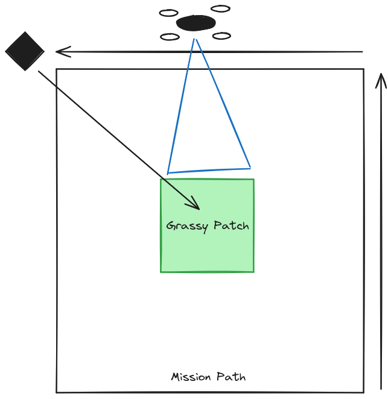

tag:: #MEETING

- {{renderer :tocgen2}}
- # 12 June 2024
  id:: 666934e0-39c9-403c-b79a-6e5ef697de5a
  collapsed:: true
	- **Attendees**
	  collapsed:: true
		- SRTA-AD
	- **Goal**
	  collapsed:: true
		- Discuss current project statuses and address any blockers.
		- Align on next steps and action points for ongoing projects.
	- **Agenda**
	  collapsed:: true
		- Update on Drone project
		- Jira follow-up
		- Nvidia DGX replacement status
		- Solita vs SRTA AD Demo target discussion
	- **Minutes**
	  collapsed:: true
		- Drone: Waiting on RJ45 adaptor
		- Jira followup:
			- predef JIRA template structure
			- same method of adding content to Jira
			- too early to conduct sprints
			- Can use Jira label for filtering if needed
		- Nvidia DGX replacement is stuck because of some geopolitical issues
		- Solita vs SRTA AD Demo target:
			- Solita is going for a Proof of concept with hybrid sim/hardware approach.
			- SRTA AD is going for a hardware proof of concept.
			- Seems to me that both parties are still not in proper sync
	- **Action Points**
	  collapsed:: true
		- DONE Write up full update for Week 23 and 24 on Confluence.
- # 5 June 2024
  id:: 666975bf-7e03-46d2-8762-f43f7b42d7ce
  collapsed:: true
	- **Attendees**
	  collapsed:: true
		- SRTA-AD
	- **Goal**
	  collapsed:: true
		- Update from the week towards demo
	- **Agenda**
	  collapsed:: true
		- Discuss progress and hold ups on my side
		- Understand the progress form everyone else
	- **Minutes**
	  collapsed:: true
		- GITEX demo
			- OpenSet speaker identification (VAuth)? It seems it isnt needed
			- Transcribing text -> language understanding
		- RTA issues on Saluki V3 as they haven't tested the SRTA modules in the V3.
	- **Action Points**
	  collapsed:: true
		- ((665ff704-5b0e-455b-b730-49c4c89148f6))
		- DONE Find out if PX4 has battery lifecycle estimation
		- DONE Confirm methodology from Sakari to launch the SRTA modules
- # 29 May 2024
  id:: 666975bf-3431-4971-aced-f257086f27a5
  collapsed:: true
	- **Attendees**
	  collapsed:: true
		- SRTA-AD
	- **Goals**
	  collapsed:: true
		- Update for demo
	- **Agenda**
	  collapsed:: true
		- Discuss progress on hold-out on physical demonstration.
	- **Minutes**
		- Moved as JIRA tasks in the SYSTEST team, so it is now in progress.
			- The main points have been clarified with John.
			- ((664f9f87-a976-490c-a59c-d068f1698a15))
		- [GITEX needs to be discussed at a later time](((66581fb0-66ca-4bc7-ae37-8f6e175f6774)))
	- **Action Points**
	  collapsed:: true
		- CANCELLED Test flight mission at 6AM @ [[May 30th, 2024]]
			- The GCS isn't communicating with the drone so cannot control autonomous missions with fog-system
			- QGC still works. Tie this in with --> ((66581d82-205a-4df6-9c16-f90213a69668))
- # 23 May 2024
  id:: 6666b7a8-30cb-4a40-8916-709c82c8a8d6
  collapsed:: true
	- **Attendees**
		- SRTA-AD
	- **Goals**
		- Demo updates and timelines
	- **Agenda**
		- Discuss how much work is left for drone flight
		- Point out blockers and problems
	- **Minutes**
		- Drone nearing flight, but no promises.
		- Documentation is sparse and heavily distributed. They make it upon request basically.
		- Have not been able to allocate time for work in the collab project due to bandwidth being utilised for the flight preparation.
		- Some work needs to be done on the data collection stuff.
	- **Action Items**
		- ((665038b5-88dc-4cf8-a496-9feb389f8c85))
		- ((66503288-71ad-481c-bb6d-2300cdffbaba))
- # 15 May 2024
  id:: 6666b7a8-6843-45a8-91fd-afe78ccaca4e
  collapsed:: true
	- **Attendees**
		- SRTA-AD
	- **Goals**
		- Demo update and timelines
	- **Agenda**
		- Discuss state of system in preparation for the demo
		- Set demo deadlines
	- **Minutes**
		- People need to go for the International Exhibition of National Security and Resilience conference in ADNEC.
		- Sakari: Building new fog-system and writing to a bootable USb to try and install into Saluki V3.
		- SRTA will be running inside the App VM.
		- Prepare a X500 as backup for far future -- not a priority at the moment.
	- **Action Item**
		- ((664498b2-da80-418c-ac4b-49c004bc01cb))
		- ((664499d6-f73c-49a9-bd7c-6d2ddd36eb87))
		- ((6644991b-cbe7-4882-9761-382fc01aeb4c))
- # 8 May 2024
  id:: 6666b7a7-9d7f-4fa4-8d55-104820d6b34b
  collapsed:: true
	- **Attendees**
	  collapsed:: true
		- SRTA-AD
	- **Goals**
	  collapsed:: true
		- Establish goals and requirements for [[Q2 June Demo]]
	- **Agenda**
	  collapsed:: true
		- Update from Sakari on GPU accessibility status
		- Update on data collection and experimentation
	- **Minutes**
	  collapsed:: true
		- Emrah and Ilkka have introduced a hack to get GPU passthrough working.
		- Passed this to Manuel, but some library dependency (libgstreamer) issue is stopping it from reaching release.
		- If we can use T-M690b for flights here over hacking Holybro-X500 it would be better.
		- RTA anomaly detection model from template --> may need to provide assistance to set up the ROS nodes for this.
		- **Safety island:** at time of total failure, have a backup working
			- for "Rabdan" SoC.
			- how to extract data at such cases?
	- **Action Items**
	  collapsed:: true
		- DONE Send data from F4F missions
			- DONE to Shamsa
			- DONE to Samridha
		- ((663b5e94-aac1-4c11-91c3-48f6fdf3a1c0))
		- ((663b5eaf-de76-4d72-8f3f-9bd0c64025f2))
- # 1 May 2024
  id:: 6666b7a7-d168-40cb-b85a-14fb97789bcc
  collapsed:: true
	- **Attendees**
	  collapsed:: true
		- SRTA-AD
	- **Goal**
	  collapsed:: true
		- Discuss who is doing a demo
		- Discuss what all are required and what the timeline will be for the demo
	- **Agenda**
	  collapsed:: true
		- Bring up the current bottlenecks for the demo
		- Update on the progress of current tasks
	- **Minutes**
	  collapsed:: true
		- Is the camera driver integration supported?
			- Apparently we have to develop our own drivers for attachments apart from standard installation.
			- Luckily the Siyi A8 is supported.
		- Check if there is packet loss when recording data on FMO?
		- Usually with demos, the flight are first done in Prague F4F before being tested in TII
	- **Action Items**
	  collapsed:: true
		- DONE Send the F4F data to Shamsa
		- ((c67ddd53-eec8-405d-bd77-4ec7a07c120d))
		- ((b314a9ab-785e-42c9-a642-90a146d98179))
		- ((f5c16267-b6ca-4126-be07-13ac7b5dcaed))
- # 25 April 2024
  id:: 6666b7a7-feec-422b-b07c-f15537ffe850
  collapsed:: true
	- **Attendees**
	  collapsed:: true
		- SRTA-AD
	- **Goals**
	  collapsed:: true
		- Introduce Iraklis as new PM
		- Update on work
	- **Agenda**
	  collapsed:: true
		- Demo requirements and updates
		- Research collaboration update
	- **Minutes**
	  collapsed:: true
		- How do we show stuff that must be demo'd? --> [Task](DONE Fill up the hardware requirements spreadsheet
		  SCHEDULED: <2024-04-26 Fri 12:00>
		  id:: 662b46fc-94b2-48b8-8db6-61a6172e6705
		  :LOGBOOK:
		  CLOCK: [2024-04-26 Fri 11:11:58]--[2024-04-26 Fri 14:05:10] =>  02:53:12
		  :END:)
		  - Breakdown into steps
		  - Do even if it isn't part of the objectives of this quarter
		  - Hardware details and requirements need to be listed and elaborated upon
		  - Image segmentation demo idea:
		  - 
		  - Flying license will take upto a week to at least start the process
		  - LLM to access outputs from RTA modules to decide on drone manouvre
		  - **Action Items**
		  collapsed:: true
		  - DONE Fill up the hardware requirements spreadsheet
		  SCHEDULED: <2024-04-26 Fri 12:00>
		  id:: 662b46fc-94b2-48b8-8db6-61a6172e6705
		  :LOGBOOK:
		  CLOCK: [2024-04-26 Fri 11:11:58]--[2024-04-26 Fri 14:05:10] =>  02:53:12
		  :END:
		- Send Raw GPS data to Siva
- # 4 April 2024
  collapsed:: true
	- **Attendees**
		- SRTA-AD
	- **Goal**
		- Discuss progress
	- **Agenda**
		- Update Jira
		- Sync-up
	- **Minutes**
		- Updates:
			- [Deployment now generating and collecting data](((65fc53d3-67f7-4f29-891c-c16e8ba9ae0f)))
			- [Syncing with Willian to hash out labelling](((660d7e6b-f931-4b91-840f-7e1903ade0a5))) and set out experimental procedure
			- Documentation up to date
			- Drone license registration needs some follow up
		- Rayana will be switching teams
	- **Action Items**
		- ((660ef536-f32e-487c-b82b-490ec9fbbb63))
- # 28 March 2024
  id:: 6666b7a6-d847-42c6-abb7-3f2e85cb03d7
  collapsed:: true
	- **Attendees**
		- SRTA-AD
	- **Goals**
		- Q1 wrap up
		- Q2 demo kickoff
	- **Agenda**
		- Update on current progress
		- Update Jira
	- **Minutes**
		- This is the last meeting of Q1
		- Update Jira separately before these round tables, it will no longer happen during the meetings
		- 15th May code freeze for Demo
		- [[Data Generation Task]]
			- Simulation and rosnodes are containerised
			- [Restructuring current method for a run-and-forget implementation](((65fc53d3-67f7-4f29-891c-c16e8ba9ae0f)))
		- [Prague data collection](((66045d50-eebf-4b61-9340-a573f6620d66)))
			- Limitations -> only rostopics can be captured in SQLite3 (lack of metadata)
			- Some stop gaps in play
			- Now way to record mission success or failure
	- **Action Items**
		- DONE Update the Q1 objectives spreadsheet by EOD
		  SCHEDULED: <2024-03-29 Fri 16:00>
		- ((66045d50-b8c7-4f49-a374-b9be3bde0463))
- # 20 March 2024
  id:: 6666b7a6-6d0b-461b-ad3b-26e4e36119ac
  collapsed:: true
	- **Attendees**
		- SRTA-AD
	- **Goals**
		- Discuss progress
	- **Agenda**
		- Update Jira
		- Sync-up
	- **Minutes**
		- *Rabdan* (previously called Falcon SOC) is going into production.
		- [[HITL simulation and data collection for system latency]] task is completed.
		- [[Literature review for Data Generation Task]] nearly complete
			- Need to discuss scope with Willian.
			- May need to reorient data collection and processing when moving for publication.
			- What makes a dataset stable?
	- **Action Items**
		- DONE Meet Shamsa to identify the cause of missing datasets in dumped logs
			- The driver is not able to capture and publish some of the prescribed data that are part of the message data-structure.
			- This results in empty values in that particular key.
- # 6 March 2024
  id:: 6666b7a6-fa07-48c9-878b-662bf36a77bc
  collapsed:: true
	- **Attendees**
		- SRTA-AD
			- Martin Andreoni
			- Willian Lunardi
			- Rayana Boubezari
			- Junior Sundar
	- **Goals**
		- Syncup with rest of team
	- **Agenda**
		- [x] Discuss progress
		- [x] Update Jira
	- **Minutes**
		- *Martin Andreoni*
			- Ticky is looking at a top down approach to objective setting. For the SRTA team, the goal is to have a demo ready (initial) by July (Q2)
			- Deadlines need to be met, with regards to the weekly reports
			- Before making submissions, make sure to proofread
			- Before sending to review, it is best to have some sort of Confluence page that discusses the achievements of the task
		- *Dania Herzolla*
			- JamLocator assumes that there is a control channel through which minimal message passing is still in place. So even if there is a disconnection by jammer, some information can still be passed around
		- *Junior Sundar*
			- Add Yashrajsinh as a collaborator in Jira tasks with him
	- **Action Items**
		- ~~Update Jira and weekly report~~
		- ~~Implement a basic ROS 2 implementation for swarm controls for Saurabh to test his algorithms~~
		- ~~Prepare logistics for updating tasks and goal given the meeting with Willian~~
			- ~~Discuss in meeting with Rayana~~